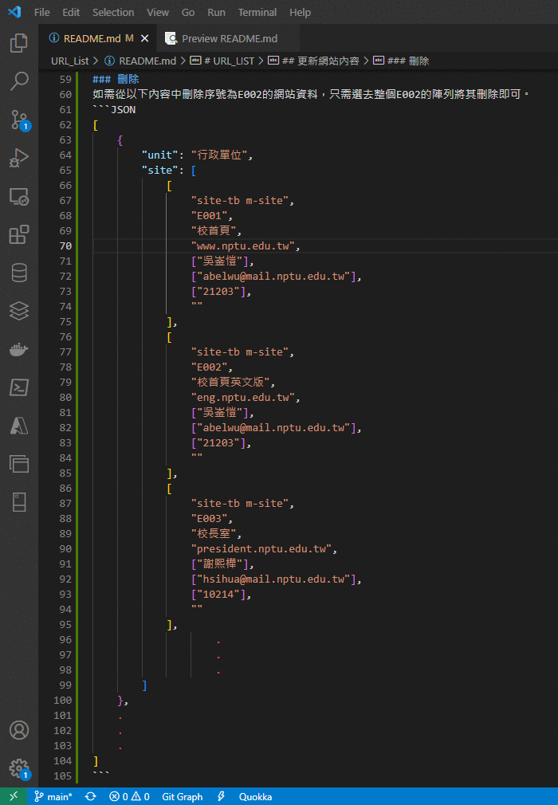

# URL_LIST
## 目錄

* [maintainer.json](#maintainerjson)
    * [格式](#格式)
    * [更新網站內容](#更新網站內容)
        * [新增](#新增)
        * [刪除](#刪除)
* [檔案功能表](#檔案功能表)

## maintainer.json

### 格式

一個Array內包著三個不同種單位的Dictionary，而Dictionary內有兩個key分別為`unit`及`site`。`unit`標示為何種單位，而`site`則是一個含有該單位所有網站的Array。

每一個網站的資訊皆包含在一個陣列裡面，而陣列的內容分別為：是否為母網`(如果是的話則需標註m-site)`、網站編號、網站名稱、網址、維護人姓名、維護人電子郵件、維護人分機、備註。

```json
[
    {
        "unit": "行政單位",
        "site": [
            [
                "site-tb m-site",
                "E001",
                "校首頁",
                "www.nptu.edu.tw",
                ["吳崟愷"],
                ["abelwu@mail.nptu.edu.tw"],
                ["21203"],
                ""
            ],
            [
                "site-tb m-site",
                "E002",
                "校首頁英文版",
                "eng.nptu.edu.tw",
                ["吳崟愷"],
                ["abelwu@mail.nptu.edu.tw"],
                ["21203"],
                ""
            ],
                .
                .
                .
        ]
    },
    .
    .
    .
]
```
### 更新網站內容
#### 新增
如果需要新增網站的話，將資料照一下格式填入並放置在正確的位置即可。
```json
[
    "site-tb (如果不是母網的話不需m-site)",
    "序號",
    "網站名稱",
    "網址",
    ["網站維護人1","網站維護人2","網站維護人3"],(如果只有一個Maintainer則填一個即可)
    ["維護人1信箱","維護人2信箱","維護人2信箱"],
    ["維護人1分機","維護人2分機","維護人3分機"],
    "備註內容"
],
```
#### 刪除
如需從以下內容中刪除序號為E002的網站資料，只需選去整個E002的陣列將其刪除即可。
```JSON
[
    {
        "unit": "行政單位",
        "site": [
            [
                "site-tb m-site",
                "E001",
                "校首頁",
                "www.nptu.edu.tw",
                ["吳崟愷"],
                ["abelwu@mail.nptu.edu.tw"],
                ["21203"],
                ""
            ],
            [
                "site-tb m-site",
                "E002",
                "校首頁英文版",
                "eng.nptu.edu.tw",
                ["吳崟愷"],
                ["abelwu@mail.nptu.edu.tw"],
                ["21203"],
                ""
            ],
            [
                "site-tb m-site",
                "E003",
                "校長室",
                "president.nptu.edu.tw",
                ["謝熙樺"],
                ["hsihua@mail.nptu.edu.tw"],
                ["10214"],
                ""
            ],
                    .
                    .
                    .
        ]
    },
    .
    .
    .
]
```


# 檔案功能表
|資料夾名稱|檔案名稱|功能|
|:--:|:--:|:--:|
|image||存放示範用的圖檔|
|old||存放舊版檔案|
|src|componenet.html|用來規定vue的模板
||maintainer.json|所有資料
||Preview.html|預覽用的html檔
||render.js|定義頁面中的元件功能
||vue.global.min.js|vue的本體
